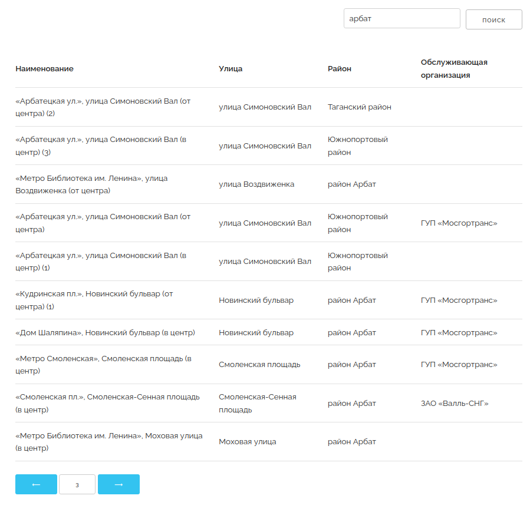

## Technical task

A web application that retrieves data from a CSV file obtained from the [open data portal](https://data.mos.ru/datasets/752). The application's main purpose is to display information about bus stations in a user-friendly manner, including their names, districts, streets, and controlling organizations. Additionally, the application should provide a search and filtration mechanism. The application should allow smooth substitution with another dataset with the same structure.

## Screenshot

## Project structure and characteristics

The project is a web application built using Django. Its main purpose is to provide a user-friendly interface for accessing information about bus stations and their maintenance organizations. The application reads data from a CSV file obtained from an open data portal and saves it to sqlite3 database. 

Users can enter search terms to find specific bus stations based on their names, streets, districts, or controlling organizations.
The search results are displayed in a paginated table, providing a user-friendly interface for navigating through the data.
The application follows a client-server architecture, where the Django server handles user requests and generates HTML responses to be displayed in the user's web browser.

In this project, direct SQL queries are used instead of migrations to directly interact with the database. This approach was chosen to simplify the process of importing data from an external CSV file and provide more flexibility in handling changes to the data structure. The decision was taken to simplify the repopulation process with new csv datasets.

The project includes a custom command called csv_to_db that facilitates the data import process from the CSV file into the database. This custom command is designed to be executed via the Django management interface. When run, it reads the specified CSV file, extracts the relevant information, such as names, districts, streets, and controlling organizations for each bus station, and saves this data into the database in a structured manner. The csv_to_db command allows for easy substitution of the dataset by specifying a different CSV file with the same structure. This command streamlines the data import process, ensuring that the application is always up-to-date with the latest dataset while maintaining the ability to switch to alternate datasets seamlessly.

## Operations manual
1. activate virtual environment as per requirements.txt
2. put relevant details to .env (example) 
3. in the root directory execute "python manage.py csv_to_db"
4. "python manage.py runserver" to run in debug mode

Whenever new dataset is required: 
- remove db.sqlite3
- update the BUS_STATION_CSV in settings.py
- repeat step 3 and 4

For deployment in production mode, follow the standard procedures specific to your deployment environment.

